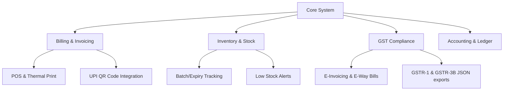

# EasyACC - Hybrid Billing & GST Accounting Software

EasyACC is a production-level, offline-first billing, inventory, and GST compliance software tailored for small businesses, merchants, and distributors. It uses a hybrid architecture that allows users to perform billing and manage inventory completely offline, and automatically syncs data to the cloud when internet connectivity is available.

---

## 🎯 Business Purpose & Target Audience

EasyACC is designed to simplify and digitalize the daily operations of small and medium-sized enterprises (SMEs), distributors, and retailers. 

### 1. Core Business Goals (Key Purposes)
*   **🔌 Zero Downtime Billing (Offline Resilience):** Retail businesses in regions with unstable internet connectivity can continue checkout processes uninterrupted. Invoices are recorded locally and sync automatically when connectivity resumes.
*   **⚖️ GST Compliance:** Automates CGST/SGST/IGST tax splits based on state codes, embeds mandatory HSN/SAC numbers, and structures billing records to meet regulatory requirements.
*   **📦 Inventory Control:** Tracks real-time stock levels, manages batch numbers, and triggers warnings for low-stock or expiring items.
*   **📓 Digital Ledger Book (Credit Ledger/Khata):** Manages buyer credit lines, monitors outstanding debt, and facilitates credit settlement histories.

### 2. Operational Workflow (How it is used)

*   **🛒 POS Checkout (Daily Sales):** The cashier scans item barcodes (or types names), selects the customer profile (Cash or Registered Account), chooses the payment method (Cash, UPI, or Credit), and prints a receipt directly to the thermal printer.
*   **🏢 Back-Office Management (Inventory Setup):** Inventory managers update stock levels, configure unit tax slabs, input buy/sell margins, and set up dynamic catalog specifications.
*   **☁️ Auto-Sync (Cloud Monitoring):** POS terminals save checkout transactions locally to RxDB, which background-syncs to the DigitalOcean server when online. This enables business owners to review live sales metrics from any browser.
*   **📑 Tax Preparation (GSTR Filing):** Accounting personnel can export standardized GSTR-1 and tax reports directly from the cloud repository for fast tax filing.

### 👥 Target Markets
*   **💊 Pharmacies & Medical Stores:** Track batch numbers, monitor drug expirations, and perform fast checkout.
*   **🍎 Grocery Stores & Supermarkets:** Speedy barcode-driven billing, POS cash registers, and physical stock count monitoring.
*   **🚚 Wholesalers & Distributors:** Support for credit lines, customer ledgers, and interstate (IGST) bulk billing.

---


## 🏛️ System Architecture

The following diagram illustrates the core system components and their functional hierarchy:




---

## 💻 Tech Stack Breakdown

### 1. Frontend (Desktop App)
*   **Electron.js:** Wraps the web application into a native desktop installer (`.exe` for Windows). Controls system-level features like hardware access (Thermal Printers, Barcode Scanners).
*   **React.js (with TypeScript):** Modern, type-safe interactive user interface.
*   **Zustand:** Highly performant, developer-friendly, and lightweight state management store (defined in [useStore.ts](file:///c:/Users/rohit/Downloads/dating_site/desktop-client/src/store/useStore.ts)) to decouple POS transaction state from UI rendering loops.
*   **Local Storage (RxDB / Realm / NeDB):** A lightweight NoSQL database running inside Electron.
    > **Note on Client DB:** Running a full MongoDB Community Server on every client machine is heavy. Instead, we use a MongoDB-compatible embedded database (like **RxDB** or **LokiJS** with Mongo query syntax) which is highly lightweight, and syncs data to our cloud MongoDB.

### 2. Backend & Synchronization Layer
*   **Node.js (Express / NestJS):** Hosted on **DigitalOcean Droplets / App Platform**. Handles user authentication, GST API calculations, cloud backups, and synchronization hooks.
*   **MongoDB (Cloud):** Hosted as a Managed Database on **DigitalOcean** or **MongoDB Atlas**. Stores consolidated multi-tenant data, business ledgers, and global product catalogs.
*   **WebSockets (Socket.io):** For real-time background synchronization and conflict resolution when the app transitions from offline to online.

### 3. Deployment & Cloud
*   **DigitalOcean App Platform / Droplet:** For deploying the Node.js API server.
*   **DigitalOcean Spaces:** Object storage for saving PDF invoices, reports, and database backups.

---

## 🔄 Offline-First Synchronization Strategy

To ensure seamless data syncing without duplicating or corrupting accounting ledger entries:

1.  **Write-Local-First:** All transactions (Invoices, Stock adjustments) are written instantly to the local embedded NoSQL database. A unique, client-generated `UUID` is assigned to each record.
2.  **Dirty Flagging:** New or updated records are marked with a status flag: `syncStatus: "pending" | "synced" | "failed"`.
3.  **Queue Manager:** The Sync Client runs a background loop. When an internet connection is detected:
    *   It sends "pending" records to the Node.js Sync Gateway.
    *   The gateway processes records sequentially using **MongoDB Sessions (Transactions)** to update stock and client ledgers.
    *   Once confirmed, the server responds with a success signal, and the client updates the flag to `"synced"`.
4.  **Conflict Resolution (Last-Write-Wins with Ledger Delta):**
    *   For Master Data (e.g., Product Prices): *Last-Write-Wins* based on timestamps.
    *   For Inventory Stock: *Delta Addition/Subtraction* (instead of replacing stock values, we apply stock adjustments like `+5` or `-10` to prevent count mismatches across multiple billing terminals).

## 📊 GST Tax Calculations (CGST / SGST / IGST)

The system automatically calculates GST (Goods and Services Tax) for each item in the cart. The calculation depends on whether the sale is **Intrastate** (within the same state) or **Interstate** (outside the state).

### Rule Logic:
1. **Intrastate (Within the same state):**
   * Triggered when the customer's state code matches the merchant's state code (defined by `MERCHANT_STATE_CODE = '19'` for West Bengal).
   * **CGST** (Central GST) and **SGST** (State GST) are applied.
   * Each tax is exactly **half** of the product's total GST rate.
   * *Formula:* 
     * `CGST = Taxable Value × (GST Rate / 2) / 100`
     * `SGST = Taxable Value × (GST Rate / 2) / 100`
     * `IGST = 0`

2. **Interstate (Outside the state):**
   * Triggered when the customer's state code is different from the merchant's state code. (If no customer is selected, it defaults to Intrastate as a cash customer).
   * **IGST** (Integrated GST) is applied at the full rate.
   * *Formula:*
     * `IGST = Taxable Value × GST Rate / 100`
     * `CGST = 0`, `SGST = 0`

---

### 🇧🇩 জিএসটি ট্যাক্স ক্যালকুলেশন মেকানিজম (বাংলা ব্যাখ্যা)

এই প্রোজেক্টে জিএসটি (CGST / SGST / IGST) ট্যাক্স হিসাব করার জন্য একটি নির্দিষ্ট নিয়ম বা লজিক ব্যবহার করা হয়েছে, যা প্রধানত বিক্রেতা (Merchant) এবং ক্রেতার (Customer) রাজ্য কোড বা **State Code**-এর ওপর নির্ভর করে।

#### ১. ইন্ট্রাস্টেট সেল (Intrastate Sale - একই রাজ্যের ভেতরে বিক্রয়):
* যখন ক্রেতার State Code এবং বিক্রেতার State Code (যেমন: `19` - পশ্চিমবঙ্গ) একই হয়, অথবা কোনো নির্দিষ্ট কাস্টমার সিলেক্ট না করে **নগদ ক্যাশ কাস্টমার** হিসেবে বিক্রি করা হয়।
* এই ক্ষেত্রে **CGST** (কেন্দ্রীয় জিএসটি) এবং **SGST** (রাজ্য জিএস应用) সমানভাবে ভাগ হয়ে যায়। প্রতিটি ট্যাক্স হবে পণ্যের নির্ধারিত মোট ট্যাক্স হারের অর্ধেক (Half of GST Rate)।
* **সূত্র (Formula):**
  * `CGST = করযোগ্য মূল্য (Taxable Value) × (জিএসটি রেট ÷ ২) ÷ ১০০`
  * `SGST = করযোগ্য মূল্য (Taxable Value) × (জিএসটি রেট ÷ ২) ÷ ১০০`
  * `IGST = ০`

#### ২. ইন্টারস্টেট সেল (Interstate Sale - অন্য রাজ্যে বিক্রয়):
* যখন ক্রেতার State Code এবং বিক্রেতার State Code (যেমন: `19` বাদে অন্য কিছু, যেমন `10` - বিহার) ভিন্ন হয়।
* এই ক্ষেত্রে সম্পূর্ণ জিএসটি **IGST** (সমন্বিত জিএসটি) হিসেবে প্রযুক্ত হবে।
* **সূত্র (Formula):**
  * `IGST = করযোগ্য মূল্য (Taxable Value) × জিএসটি রেট ÷ ১০০`
  * `CGST = ০`, `SGST = ০`

#### উদাহরণ (Example):
যদি কোনো পণ্যের দাম `১০০০ টাকা` হয় এবং এর জিএসটি রেট `১৮%` হয়:
* **ইন্ট্রাস্টেট (একই রাজ্যে):**
  * করযোগ্য মূল্য = ১০০০ টাকা
  * CGST (৯%) = ৯০ টাকা
  * SGST (৯%) = ৯০ টাকা
  * সর্বমোট বিল = ১১৮০ টাকা
* **ইন্টারস্টেট (অন্য রাজ্যে):**
  * করযোগ্য মূল্য = ১০০০ টাকা
  * IGST (১৮%) = ১৮০ টাকা
  *  সর্বমোট বিল = ১১৮০ টাকা

---

## ⚡ Performance Optimization & Indexing Guidelines

To ensure the POS remains extremely fast even when handling tens of thousands of catalog items and invoices, we implemented database indexing, paginated queries, and state management optimizations across both the desktop client and cloud backend.

### 1. Client-Side Database Optimization (RxDB / Dexie)
*   **Versioned Schema Upgrade:** Upgraded local collection schemas to version `1` and registered `RxDBMigrationSchemaPlugin` to ensure smooth migration pathways during updates.
*   **Index Constraints:** Indexed properties are bounded using `maxLength: 100` properties in schema definitions, satisfying Dexie's indexing requirements.
*   **Indexed Fields:**
    *   `products`: `['sku', 'name', 'hsnCode', 'updatedAt']`
    *   `customers`: `['name', 'phone', 'updatedAt']`
    *   `invoices`: `['invoiceNumber', 'customerName', 'date', 'customerId']`
*   **Index-Driven Queries:** Queries (e.g. searching products or filtering invoices) use index-supported selectors and sort keys (`sort: [{ name: 'asc' }]` or `sort: [{ date: 'desc' }]`) to avoid full-table scans.
*   **Skip/Limit Offsets:** The local store uses `.find().skip(offset).limit(limit)` to fetch only the required page of items into client memory.

### 2. Backend & Server-Side Database Optimization (MongoDB / Mongoose)
*   **Mongoose Indexes:** Added compound and single-field indexes directly at the schema layer to optimize read-heavy API routes:
    *   `Product`: `{ name: 1 }`, `{ sku: 1 }`, `{ hsnCode: 1 }`, `{ updatedAt: -1 }`
    *   `Customer`: `{ name: 1 }`, `{ phone: 1 }`, `{ updatedAt: -1 }`
    *   `Invoice`: `{ invoiceNumber: 1 }`, `{ customerName: 1 }`, `{ customerId: 1 }`, `{ date: -1 }`, `{ updatedAt: -1 }`
*   **Server-Side Pagination:** Created paginated endpoints `/api/inventory` and `/api/invoices` using native MongoDB query piping:
    ```typescript
    const items = await Product.find(query)
      .sort({ name: 1 })
      .skip((page - 1) * limit)
      .limit(limit);
    ```
    This keeps network payloads small and page loads fast.

### 3. Frontend UI Optimization Techniques
*   **Selective Zustand Memory Storage:** Avoided loading the entire database arrays (e.g. all lifetime invoices) in local JavaScript memory. Instead, the global store only loads current search matching pages.
*   **On-Demand Local DB Queries:** Tab views like GSTR-1 (`Gstr1TaxTab.tsx`) and Khata Book (`CreditBookTab.tsx`) query filtered datasets directly from RxDB on demand instead of computing statistics from massive in-memory arrays.
*   **DOM Node Reduction (Component Decoupling):** Decomposed `Billing.tsx` into modular components. Visual state edits (e.g. cart adjustments, form inputs) are scoped locally to avoid triggers of parent-level component re-renders.
*   **Visual Pagination Footers:** Tables for Inventory and Invoices use paginated footers rendering up to 10 rows at a time, preventing rendering bottlenecks in the React virtua## ⚙️ Desktop App Setup (.exe Guide) | ডেক্সটপ অ্যাপ সেটআপ (.exe গাইড)

This guide explains how to install and configure the EasyACC desktop billing application from the setup `.exe` file.
এই গাইডটি কিভাবে সেটআপ `.exe` ফাইল থেকে EasyACC ডেক্সটপ বিলিং অ্যাপ্লিকেশন ইনস্টল এবং কনফিগার করবেন তা ব্যাখ্যা করে।

### 📋 Prerequisites / প্রয়োজনীয়তা

| English | বাংলা |
| :--- | :--- |
| **System:** Windows 10 or Windows 11 (64-bit). | **সিস্টেম:** উইন্ডোজ ১০ বা উইন্ডোজ ১১ (৬৪-বিট)। |
| **Privileges:** Administrator access (for initial installation and printer setup). | **অনুমতি:** অ্যাডমিনিস্ট্রেটর অ্যাক্সেস (প্রাথমিক ইনস্টলেশন এবং প্রিন্টার সেটআপের জন্য)। |
| **Hardware:** USB Thermal Receipt Printer (optional, for printing bills) & Barcode Scanner. | **হার্ডওয়্যার:** ইউএসবি থার্মাল রিসিপ্ট প্রিন্টার (ঐচ্ছিক, বিল প্রিন্ট করার জন্য) এবং বারকোড স্ক্যানার। |

### ⚙️ Step-by-Step Installation / ধাপে ধাপে ইনস্টলেশন প্রক্রিয়া

| Step (English) |  (বাংলা) |
| :--- | :--- |
| **Step 1: Locate the Installer**<br>Navigate to the project build folder `desktop-client/dist/` and locate the file named `easyacc-desktop Setup 1.0.0.exe`. | **ধাপ ১: ইনস্টলারটি খুঁজুন**<br>প্রোজেক্টের বিল্ড ফোল্ডার `desktop-client/dist/`-এ যান এবং `easyacc-desktop Setup 1.0.0.exe` নামের ফাইলটি খুঁজুন। |
| **Step 2: Run the Setup File**<br>Double-click the `.exe` file to start the installation. | **ধাপ ২: সেটআপ ফাইলটি রান করুন**<br>ইনস্টলেশন শুরু করতে `.exe` ফাইলটিতে ডাবল-ক্লিক করুন। |
| **Step 3: SmartScreen Warning (If shown)**<br>Since this is a custom local build (unsigned package), Windows SmartScreen might block it.<br>1. Click **"More Info"**.<br>2. Click **"Run anyway"**. | **ধাপ ৩: স্মার্টস্ক্রিন সতর্কতা (যদি দেখায়)**<br>যেহেতু এটি একটি কাস্টম লোকাল বিল্ড (স্বাক্ষরবিহীন প্যাকেজ), উইন্ডোজ স্মার্টস্ক্রিন এটি ব্লক করতে পারে।<br>১. **"More Info"**-এ ক্লিক করুন।<br>২. **"Run anyway"**-এ ক্লিক করুন। |
| **Step 4: Installation Complete**<br>The setup installer runs in one-click mode. It will install the application files, place a shortcut icon named **EasyACC** on your Desktop, and launch the application automatically. | **ধাপ ৪: ইনস্টলেশন সম্পন্ন**<br>সেটআপ ইনস্টলারটি ওয়ান-ক্লিক মোডে চলে। এটি অ্যাপের ফাইলগুলো ইনস্টল করবে, আপনার ডেক্সটপে **EasyACC** নামে একটি শর্টকাট আইকন তৈরি করবে এবং স্বয়ংক্রিয়ভাবে অ্যাপটি চালু করবে। |

### 🌐 Phase 1: Set up Your Private Backup Server / 1. নিজস্ব ব্যাকআপ সার্ভার চালু করা

| English | বাংলা |
| :--- | :--- |
| **What is a Backend Server?**<br>Think of the backend as a secure digital filing cabinet in the cloud. It receives and stores all sales invoices and inventory updates from your offline billing terminals. | **ব্যাকএন্ড সার্ভার কী?**<br>ব্যাকএন্ডকে ক্লাউডের একটি নিরাপদ ডিজিটাল ফাইলিং ক্যাবিনেট বা আলমারি হিসেবে চিন্তা করুন। এটি আপনার অফলাইন বিলিং টার্মিনাল থেকে সমস্ত বিক্রয় চালান এবং ইনভেন্টরি আপডেট গ্রহণ করে সংরক্ষণ করে। |
| **How to set it up:**<br>1. Purchase a Virtual Private Server (VPS) from providers like AWS, DigitalOcean, or set up a main host computer on your office Local Network (LAN).<br>2. Upload the `backend` folder to this server.<br>3. Install **Node.js** and **MongoDB** (the database engine) on the server.<br>4. Start the server (Nginx should reverse-proxy traffic to port `5005` so it can be reached via a standard URL or IP). | **কীভাবে এটি সেটআপ করবেন:**<br>১. AWS, DigitalOcean বা অন্য কোনো প্রোভাইডার থেকে একটি ভার্চুয়াল প্রাইভেট সার্ভার (VPS) কিনুন, অথবা আপনার অফিসের লোকাল নেটওয়ার্কের (LAN) একটি মেইন কম্পিউটার নির্ধারণ করুন।<br>২. এই সার্ভারে `backend` ফোল্ডারটি আপলোড করুন।<br>৩. সার্ভারে **Node.js** and **MongoDB** (ডাটাবেস ইঞ্জিন) ইনস্টল করুন।<br>৪. সার্ভারটি স্টার্ট করুন (Nginx কনফিগারেশন সেট করুন যেন এটি আইপি বা ডোমেইনের মাধ্যমে কানেক্ট হতে পারে)। |

### 🔗 Phase 2: Link the Desktop App to Your Server / 2. ডেক্সটপ অ্যাপের সাথে সার্ভার লিংক করা

| English | বাংলা |
| :--- | :--- |
| Now, tell your desktop application where your cloud server is located:<br><br>1. Open the project folder on your computer.<br>2. Open the **`desktop-client`** folder.<br>3. Find or create a file named **`.env`** (you can open this in Notepad).<br>4. Type the following line, replacing the IP with your server's IP address:<br>`REACT_APP_BACKEND_URL=http://YOUR_SERVER_IP` | এখন, আপনার ডেক্সটপ অ্যাপ্লিকেশনটিকে বলুন আপনার ক্লাউড সার্ভারটি কোথায় অবস্থিত:<br><br>১. আপনার কম্পিউটারে প্রোজেক্ট ফোল্ডারটি ওপেন করুন।<br>২. **`desktop-client`** ফোল্ডারে যান।<br>৩. **`.env`** নামের ফাইলটি খুঁজুন বা তৈরি করুন (এটি নোটপ্যাডে ওপেন করতে পারেন)।<br>৪. নিচের লাইনটি লিখুন এবং আপনার সার্ভারের আইপি দিয়ে রিপ্লেস করুন:<br>`REACT_APP_BACKEND_URL=http://YOUR_SERVER_IP` |

### 🔨 Phase 3: Build Your Custom Installer (.exe) / 3. আপনার নিজস্ব ইনস্টলার (.exe) তৈরি করা

| English | বাংলা |
| :--- | :--- |
| To generate the final installer `.exe` containing your new server link, open your VS Code terminal (or Command Prompt) and run these 3 simple commands step-by-step: | আপনার নতুন সার্ভারের লিঙ্কসহ চূড়ান্ত ইনস্টলার `.exe` তৈরি করতে, আপনার ভিএস কোড টার্মিনাল (বা কমান্ড প্রম্পট) ওপেন করুন এবং ধাপে ধাপে এই ৩টি সহজ কমান্ড রান করুন: |
| **Step A: Enter the client directory**<br>```bash<br>cd desktop-client<br>``` | **ধাপ ক: ক্লায়েন্ট ডিরেক্টরিতে প্রবেশ করুন**<br>```bash<br>cd desktop-client<br>``` |
| **Step B: Package the web files**<br>```bash<br>npm run react-build<br>```<br>*This prepares the React user interface to load with relative local paths.* | **ধাপ খ: ওয়েব ফাইলগুলো প্যাকেজ করুন**<br>```bash<br>npm run react-build<br>```<br>*এটি রিঅ্যাক্ট ইউজার ইন্টারফেস ফাইলগুলোকে লোকাল পাথে লোড হওয়ার জন্য প্রস্তুত করবে।* |
| **Step C: Generate the installer**<br>```bash<br>npx electron-builder<br>```<br>*This bundles everything into a single `.exe` file.* | **ধাপ গ: ইনস্টলার তৈরি করুন**<br>```bash<br>npx electron-builder<br>```<br>*এটি সবকিছুকে একটি একক `.exe` ফাইলে প্যাকেজ করবে।* |
| **Result:**<br>Open the newly created **`dist`** folder inside `desktop-client` and run the setup file named **`easyacc-desktop Setup 1.0.0.exe`** to install your custom billing system. | **ফলাফল:**<br>`desktop-client` এর ভেতরে নতুন তৈরি হওয়া **`dist`** ফোল্ডারটি ওপেন করুন এবং আপনার কাস্টম বিলিং সিস্টেম ইনস্টল করতে **`easyacc-desktop Setup 1.0.0.exe`** সেটআপ ফাইলটি রান করুন। |

### 🖨️ Thermal Printer & Scanner Config / থার্মাল প্রিন্টার ও স্ক্যানার কনফিগারেশন

| English | বাংলা |
| :--- | :--- |
| **Barcode Scanner:** Any standard USB barcode scanner works plug-and-play. Connect the scanner to a USB port, click on the POS search bar, and scan a barcode.<br><br>**Thermal Receipt Printer:** Connect your printer via USB. Ensure the printer driver is installed in Windows, and set it as the default printer to enable one-click silent receipt printing. | **বারকোড স্ক্যানার:** যেকোনো স্ট্যান্ডার্ড ইউএসবি বারকোড স্ক্যানার প্লাগ-অ্যান্ড-প্লে হিসেবে কাজ করে। স্ক্যানারটি ইউএসবি পোর্টে কানেক্ট করুন, পিওএস সার্চ বারে ক্লিক করুন এবং বারকোড স্ক্যান করুন।<br><br>**থার্মাল রিসিপ্ট প্রিন্টার:** ইউএসবি-র মাধ্যমে আপনার প্রিন্টার কানেক্ট করুন। উইন্ডোজে প্রিন্টার ড্রাইভার ইনস্টল করা আছে তা নিশ্চিত করুন, এবং ওয়ান-ক্লিক সাইলেন্ট প্রিন্ট সক্রিয় করতে এটিকে ডিফল্ট প্রিন্টার হিসেবে সেট করুন। |


---

## 🚀 Development Setup (Getting Started)

### Prerequisites
*   Node.js (v18+)
*   Docker and Docker Compose (for running MongoDB locally)

### 1. Start MongoDB with Docker
Run the following commands in the `backend` directory to spin up MongoDB and the Mongo Express admin panel:
```bash
cd backend
docker-compose up -d
```
*   **MongoDB Port:** `27017`
*   **Mongo Express Dashboard:** [http://localhost:8081](http://localhost:8081) (Login details: admin / pass)

### 2. Backend Server Setup
```bash
cd backend
npm install
# Set up .env with MONGODB_URI, PORT, and JWT_SECRET (see .env.example)
npm run dev
```

### 3. Electron + React App Setup
```bash
cd desktop-client
npm install
# Runs React development server & Electron shell simultaneously
npm run dev
```

### 4. Packaging the Desktop App (.exe)
To package the React web app into a standalone Windows installer (`.exe`), compile the static assets and run the builder:
```bash
cd desktop-client
npm run react-build
npx electron-builder
```

#### ⚠️ Troubleshooting: winCodeSign Symlink Error on Windows
When packaging on Windows, `electron-builder` might fail with a symbolic link error:
`Cannot create symbolic link : A required privilege is not held by the client.`

To resolve this:
1. Open Windows **Settings**.
2. Go to **Privacy & security** > **For developers**.
3. Toggle **Developer Mode** to **On** (this allows symbolic links to be created without administrator privilege elevation).
4. Re-run the packaging build.
