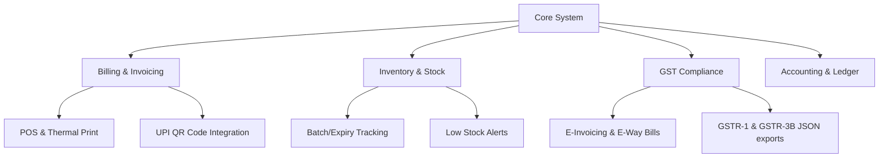

# EasyACC - Hybrid Billing & GST Accounting Software

EasyACC is a production-level, offline-first billing, inventory, and GST compliance software tailored for small businesses, merchants, and distributors. It uses a hybrid architecture that allows users to perform billing and manage inventory completely offline, and automatically syncs data to the cloud when internet connectivity is available.

---

## 🎯 Business Purpose & Target Audience

EasyACC is designed to simplify and digitalize the daily operations of small and medium-sized enterprises (SMEs), distributors, and retailers. 

### 1. Core Business Goals (Key Purposes)
*   **🔌 Zero Downtime Billing (Offline Resilience):** Retail businesses in regions with unstable internet connectivity can continue checkout processes uninterrupted. Invoices are recorded locally and sync automatically when connectivity resumes.
*   **⚖️ GST Compliance:** Automates CGST/SGST/IGST tax splits based on state codes, embeds mandatory HSN/SAC numbers, and structures billing records to meet regulatory requirements.
*   **📦 Inventory Control:** Tracks real-time stock levels, manages batch numbers, and triggers warnings for low-stock or expiring items.
*   **📓 Digital Ledger Book (Credit Ledger/Khata):** Manages buyer credit lines, monitors outstanding debt, and facilitates credit settlement histories.

### 2. Operational Workflow (How it is used)

*   **🛒 POS Checkout (Daily Sales):** The cashier scans item barcodes (or types names), selects the customer profile (Cash or Registered Account), chooses the payment method (Cash, UPI, or Credit), and prints a receipt directly to the thermal printer.
*   **🏢 Back-Office Management (Inventory Setup):** Inventory managers update stock levels, configure unit tax slabs, input buy/sell margins, and set up dynamic catalog specifications.
*   **☁️ Auto-Sync (Cloud Monitoring):** POS terminals save checkout transactions locally to RxDB, which background-syncs to the DigitalOcean server when online. This enables business owners to review live sales metrics from any browser.
*   **📑 Tax Preparation (GSTR Filing):** Accounting personnel can export standardized GSTR-1 and tax reports directly from the cloud repository for fast tax filing.

### 👥 Target Markets
*   **💊 Pharmacies & Medical Stores:** Track batch numbers, monitor drug expirations, and perform fast checkout.
*   **🍎 Grocery Stores & Supermarkets:** Speedy barcode-driven billing, POS cash registers, and physical stock count monitoring.
*   **🚚 Wholesalers & Distributors:** Support for credit lines, customer ledgers, and interstate (IGST) bulk billing.

---


## 🏛️ System Architecture

The following diagram illustrates the core system components and their functional hierarchy:




---

## 💻 Tech Stack Breakdown

### 1. Frontend (Desktop App)
*   **Electron.js:** Wraps the web application into a native desktop installer (`.exe` for Windows). Controls system-level features like hardware access (Thermal Printers, Barcode Scanners).
*   **React.js (with TypeScript):** Modern, type-safe interactive user interface.
*   **Zustand:** Highly performant, developer-friendly, and lightweight state management store (defined in [useStore.ts](file:///c:/Users/rohit/Downloads/dating_site/desktop-client/src/store/useStore.ts)) to decouple POS transaction state from UI rendering loops.
*   **Local Storage (RxDB / Realm / NeDB):** A lightweight NoSQL database running inside Electron.
    > **Note on Client DB:** Running a full MongoDB Community Server on every client machine is heavy. Instead, we use a MongoDB-compatible embedded database (like **RxDB** or **LokiJS** with Mongo query syntax) which is highly lightweight, and syncs data to our cloud MongoDB.

### 2. Backend & Synchronization Layer
*   **Node.js (Express / NestJS):** Hosted on **DigitalOcean Droplets / App Platform**. Handles user authentication, GST API calculations, cloud backups, and synchronization hooks.
*   **MongoDB (Cloud):** Hosted as a Managed Database on **DigitalOcean** or **MongoDB Atlas**. Stores consolidated multi-tenant data, business ledgers, and global product catalogs.
*   **WebSockets (Socket.io):** For real-time background synchronization and conflict resolution when the app transitions from offline to online.

### 3. Deployment & Cloud
*   **DigitalOcean App Platform / Droplet:** For deploying the Node.js API server.
*   **DigitalOcean Spaces:** Object storage for saving PDF invoices, reports, and database backups.

---

## 🔄 Offline-First Synchronization Strategy

To ensure seamless data syncing without duplicating or corrupting accounting ledger entries:

1.  **Write-Local-First:** All transactions (Invoices, Stock adjustments) are written instantly to the local embedded NoSQL database. A unique, client-generated `UUID` is assigned to each record.
2.  **Dirty Flagging:** New or updated records are marked with a status flag: `syncStatus: "pending" | "synced" | "failed"`.
3.  **Queue Manager:** The Sync Client runs a background loop. When an internet connection is detected:
    *   It sends "pending" records to the Node.js Sync Gateway.
    *   The gateway processes records sequentially using **MongoDB Sessions (Transactions)** to update stock and client ledgers.
    *   Once confirmed, the server responds with a success signal, and the client updates the flag to `"synced"`.
4.  **Conflict Resolution (Last-Write-Wins with Ledger Delta):**
    *   For Master Data (e.g., Product Prices): *Last-Write-Wins* based on timestamps.
    *   For Inventory Stock: *Delta Addition/Subtraction* (instead of replacing stock values, we apply stock adjustments like `+5` or `-10` to prevent count mismatches across multiple billing terminals).

## 📊 GST Tax Calculations (CGST / SGST / IGST)

The system automatically calculates GST (Goods and Services Tax) for each item in the cart. The calculation depends on whether the sale is **Intrastate** (within the same state) or **Interstate** (outside the state).

### Rule Logic:
1. **Intrastate (Within the same state):**
   * Triggered when the customer's state code matches the merchant's state code (defined by `MERCHANT_STATE_CODE = '19'` for West Bengal).
   * **CGST** (Central GST) and **SGST** (State GST) are applied.
   * Each tax is exactly **half** of the product's total GST rate.
   * *Formula:* 
     * `CGST = Taxable Value × (GST Rate / 2) / 100`
     * `SGST = Taxable Value × (GST Rate / 2) / 100`
     * `IGST = 0`

2. **Interstate (Outside the state):**
   * Triggered when the customer's state code is different from the merchant's state code. (If no customer is selected, it defaults to Intrastate as a cash customer).
   * **IGST** (Integrated GST) is applied at the full rate.
   * *Formula:*
     * `IGST = Taxable Value × GST Rate / 100`
     * `CGST = 0`, `SGST = 0`

---

### 🇧🇩 জিএসটি ট্যাক্স ক্যালকুলেশন মেকানিজম (বাংলা ব্যাখ্যা)

এই প্রোজেক্টে জিএসটি (CGST / SGST / IGST) ট্যাক্স হিসাব করার জন্য একটি নির্দিষ্ট নিয়ম বা লজিক ব্যবহার করা হয়েছে, যা প্রধানত বিক্রেতা (Merchant) এবং ক্রেতার (Customer) রাজ্য কোড বা **State Code**-এর ওপর নির্ভর করে।

#### ১. ইন্ট্রাস্টেট সেল (Intrastate Sale - একই রাজ্যের ভেতরে বিক্রয়):
* যখন ক্রেতার State Code এবং বিক্রেতার State Code (যেমন: `19` - পশ্চিমবঙ্গ) একই হয়, অথবা কোনো নির্দিষ্ট কাস্টমার সিলেক্ট না করে **নগদ ক্যাশ কাস্টমার** হিসেবে বিক্রি করা হয়।
* এই ক্ষেত্রে **CGST** (কেন্দ্রীয় জিএসটি) এবং **SGST** (রাজ্য জিএস应用) সমানভাবে ভাগ হয়ে যায়। প্রতিটি ট্যাক্স হবে পণ্যের নির্ধারিত মোট ট্যাক্স হারের অর্ধেক (Half of GST Rate)।
* **সূত্র (Formula):**
  * `CGST = করযোগ্য মূল্য (Taxable Value) × (জিএসটি রেট ÷ ২) ÷ ১০০`
  * `SGST = করযোগ্য মূল্য (Taxable Value) × (জিএসটি রেট ÷ ২) ÷ ১০০`
  * `IGST = ০`

#### ২. ইন্টারস্টেট সেল (Interstate Sale - অন্য রাজ্যে বিক্রয়):
* যখন ক্রেতার State Code এবং বিক্রেতার State Code (যেমন: `19` বাদে অন্য কিছু, যেমন `10` - বিহার) ভিন্ন হয়।
* এই ক্ষেত্রে সম্পূর্ণ জিএসটি **IGST** (সমন্বিত জিএসটি) হিসেবে প্রযুক্ত হবে।
* **সূত্র (Formula):**
  * `IGST = করযোগ্য মূল্য (Taxable Value) × জিএসটি রেট ÷ ১০০`
  * `CGST = ০`, `SGST = ০`

#### উদাহরণ (Example):
যদি কোনো পণ্যের দাম `১০০০ টাকা` হয় এবং এর জিএসটি রেট `১৮%` হয়:
* **ইন্ট্রাস্টেট (একই রাজ্যে):**
  * করযোগ্য মূল্য = ১০০০ টাকা
  * CGST (৯%) = ৯০ টাকা
  * SGST (৯%) = ৯০ টাকা
  * সর্বমোট বিল = ১১৮০ টাকা
* **ইন্টারস্টেট (অন্য রাজ্যে):**
  * করযোগ্য মূল্য = ১০০০ টাকা
  * IGST (১৮%) = ১৮০ টাকা
  *  সর্বমোট বিল = ১১৮০ টাকা

---

## ⚡ Performance Optimization & Indexing Guidelines

To ensure the POS remains extremely fast even when handling tens of thousands of catalog items and invoices, we implemented database indexing, paginated queries, and state management optimizations across both the desktop client and cloud backend.

### 1. Client-Side Database Optimization (RxDB / Dexie)
*   **Versioned Schema Upgrade:** Upgraded local collection schemas to version `1` and registered `RxDBMigrationSchemaPlugin` to ensure smooth migration pathways during updates.
*   **Index Constraints:** Indexed properties are bounded using `maxLength: 100` properties in schema definitions, satisfying Dexie's indexing requirements.
*   **Indexed Fields:**
    *   `products`: `['sku', 'name', 'hsnCode', 'updatedAt']`
    *   `customers`: `['name', 'phone', 'updatedAt']`
    *   `invoices`: `['invoiceNumber', 'customerName', 'date', 'customerId']`
*   **Index-Driven Queries:** Queries (e.g. searching products or filtering invoices) use index-supported selectors and sort keys (`sort: [{ name: 'asc' }]` or `sort: [{ date: 'desc' }]`) to avoid full-table scans.
*   **Skip/Limit Offsets:** The local store uses `.find().skip(offset).limit(limit)` to fetch only the required page of items into client memory.

### 2. Backend & Server-Side Database Optimization (MongoDB / Mongoose)
*   **Mongoose Indexes:** Added compound and single-field indexes directly at the schema layer to optimize read-heavy API routes:
    *   `Product`: `{ name: 1 }`, `{ sku: 1 }`, `{ hsnCode: 1 }`, `{ updatedAt: -1 }`
    *   `Customer`: `{ name: 1 }`, `{ phone: 1 }`, `{ updatedAt: -1 }`
    *   `Invoice`: `{ invoiceNumber: 1 }`, `{ customerName: 1 }`, `{ customerId: 1 }`, `{ date: -1 }`, `{ updatedAt: -1 }`
*   **Server-Side Pagination:** Created paginated endpoints `/api/inventory` and `/api/invoices` using native MongoDB query piping:
    ```typescript
    const items = await Product.find(query)
      .sort({ name: 1 })
      .skip((page - 1) * limit)
      .limit(limit);
    ```
    This keeps network payloads small and page loads fast.

### 3. Frontend UI Optimization Techniques
*   **Selective Zustand Memory Storage:** Avoided loading the entire database arrays (e.g. all lifetime invoices) in local JavaScript memory. Instead, the global store only loads current search matching pages.
*   **On-Demand Local DB Queries:** Tab views like GSTR-1 (`Gstr1TaxTab.tsx`) and Khata Book (`CreditBookTab.tsx`) query filtered datasets directly from RxDB on demand instead of computing statistics from massive in-memory arrays.
*   **DOM Node Reduction (Component Decoupling):** Decomposed `Billing.tsx` into modular components. Visual state edits (e.g. cart adjustments, form inputs) are scoped locally to avoid triggers of parent-level component re-renders.
*   **Visual Pagination Footers:** Tables for Inventory and Invoices use paginated footers rendering up to 10 rows at a time, preventing rendering bottlenecks in the React virtual DOM.

---

## 📂 Key MongoDB Schema Guidelines (Mongoose Models)


### Invoices Collection Schema
```javascript
const InvoiceSchema = new mongoose.Schema({
  invoiceId: { type: String, required: true, unique: true }, // Client-side generated UUID
  invoiceNumber: { type: String, required: true },
  date: { type: Date, required: true },
  customerId: { type: mongoose.Schema.Types.ObjectId, ref: 'Customer' },
  customerName: { type: String, required: true },
  customerGSTIN: { type: String },
  billingStateCode: { type: String, required: true },
  items: [{
    productId: { type: mongoose.Schema.Types.ObjectId, ref: 'Product' },
    name: { type: String, required: true },
    hsnCode: { type: String, required: true },
    quantity: { type: Number, required: true },
    unitPrice: { type: mongoose.Types.Decimal128, required: true },
    taxableValue: { type: mongoose.Types.Decimal128, required: true },
    gstRate: { type: Number, required: true },
    cgst: { type: mongoose.Types.Decimal128, default: 0 },
    sgst: { type: mongoose.Types.Decimal128, default: 0 },
    igst: { type: mongoose.Types.Decimal128, default: 0 }
  }],
  totals: {
    taxableAmount: { type: mongoose.Types.Decimal128, required: true },
    totalCGST: { type: mongoose.Types.Decimal128, default: 0 },
    totalSGST: { type: mongoose.Types.Decimal128, default: 0 },
    totalIGST: { type: mongoose.Types.Decimal128, default: 0 },
    grandTotal: { type: mongoose.Types.Decimal128, required: true }
  },
  paymentStatus: { type: String, enum: ['Paid', 'Unpaid', 'Partial'], default: 'Unpaid' },
  syncStatus: { type: String, enum: ['pending', 'synced', 'failed'], default: 'pending' },
  updatedAt: { type: Date, default: Date.now }
});
```

---

## 🚀 Development Setup (Getting Started)

### Prerequisites
*   Node.js (v18+)
*   Docker and Docker Compose (for running MongoDB locally)

### 1. Start MongoDB with Docker
Run the following commands in the `backend` directory to spin up MongoDB and the Mongo Express admin panel:
```bash
cd backend
docker-compose up -d
```
*   **MongoDB Port:** `27017`
*   **Mongo Express Dashboard:** [http://localhost:8081](http://localhost:8081) (Login details: admin / pass)

### 2. Backend Server Setup
```bash
cd backend
npm install
# Set up .env with MONGODB_URI, PORT, and JWT_SECRET (see .env.example)
npm run dev
```

### 2. Electron + React App Setup
```bash
cd frontend
npm install
# Runs React development server & Electron shell simultaneously
npm run dev
```
